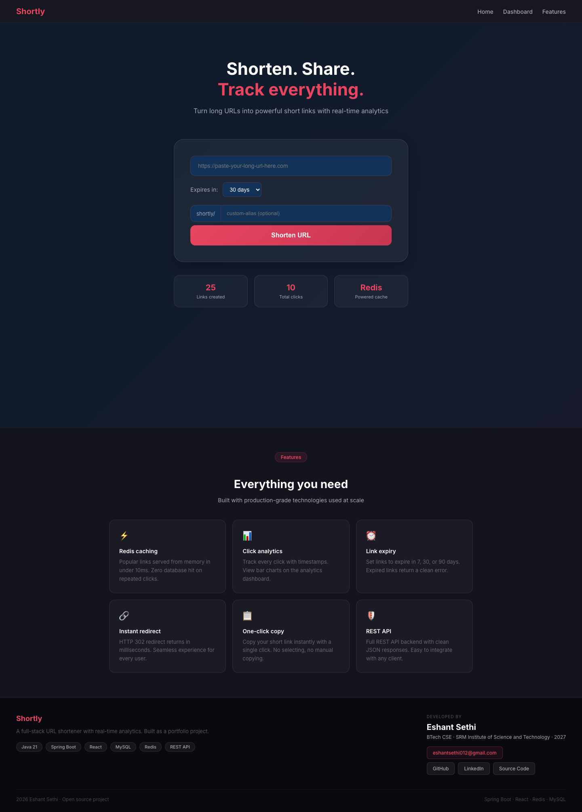
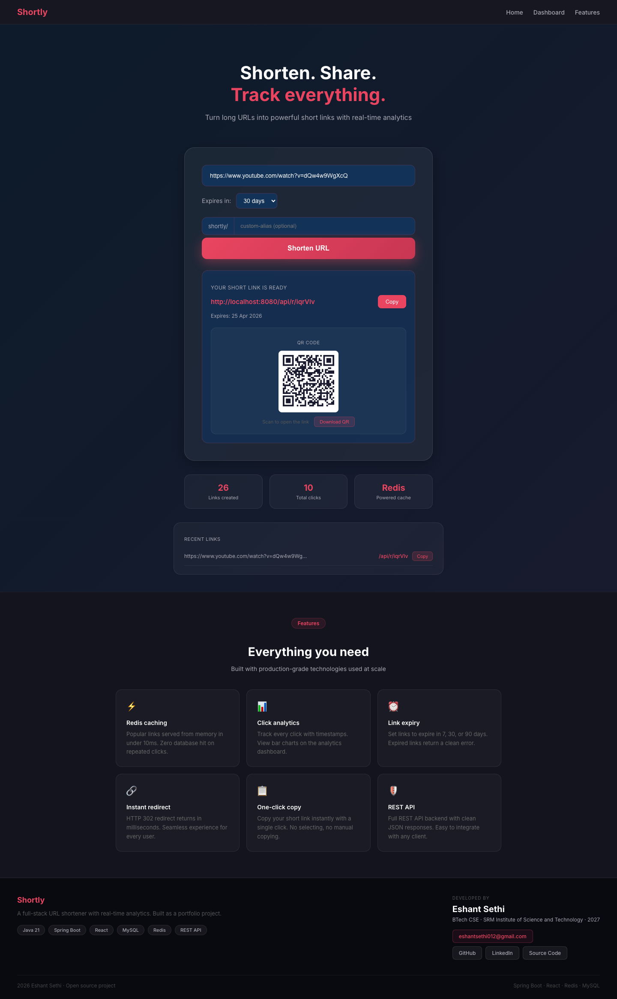
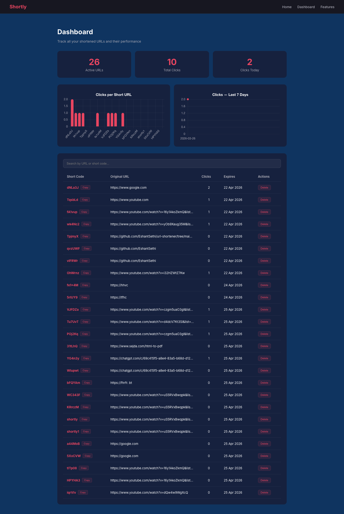
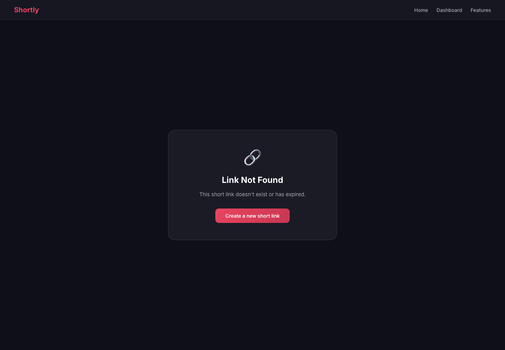

# Shortly — URL Shortener

A full-stack URL shortener with click analytics, custom aliases, and Redis caching — built with Spring Boot, React, and MySQL.


---

## Demo

[](assets/demo.mp4)

> Click the image above or view [`assets/demo.mp4`](assets/demo.mp4) for a full walkthrough.

---

## Screenshots

### Home — Shorten a URL


### Result with QR Code


### Analytics Dashboard


### Link Not Found


---

## Features

- Shorten any URL to a clean short link
- **Custom aliases** — pick your own short code (e.g. `shortly/my-link`)
- One-click copy to clipboard with toast notification
- QR code generated for every link
- Set custom expiry (7 / 30 / 90 days or never)
- Real-time click tracking per link
- **Analytics dashboard** — bar chart (clicks per URL) + line chart (clicks over last 7 days)
- Redis caching for sub-10ms redirects
- Search and filter links on the dashboard

## Tech Stack

| Layer | Technology |
|-------|-----------|
| Frontend | React 19, React Router v7, Chart.js, Axios |
| Backend | Java 21, Spring Boot 3.5 |
| Database | MySQL |
| Cache | Redis |
| Build Tool | Maven |

## Architecture

```
User → React (port 3000)
           ↓
    Spring Boot API (port 8080)
           ↓
    Check Redis cache first
    If not cached → MySQL
           ↓
    Return redirect + increment click count
    Record ClickEvent with timestamp
```

## API Endpoints

| Method | Endpoint | Description |
|--------|----------|-------------|
| POST | `/api/shorten` | Create a short URL (supports custom alias + expiry) |
| GET | `/api/r/{shortCode}` | Redirect to original URL |
| GET | `/api/urls` | Get all URLs with analytics |
| DELETE | `/api/urls/{id}` | Delete a URL mapping |
| GET | `/api/analytics` | Clicks grouped by day (last 7 days) |

## How to Run Locally

### Prerequisites
- Java 21
- Node.js 20+
- MySQL (create a database named `urlshortener`)
- Redis

### Backend
```bash
cd backend
# Set env vars or edit application.properties with your credentials
mvn spring-boot:run
```

### Frontend
```bash
cd frontend
cp .env.example .env        # set REACT_APP_API_URL=http://localhost:8080/api
npm install
npm start
```

Open `http://localhost:3000` in your browser.

### Environment Variables

| Variable | Default | Description |
|----------|---------|-------------|
| `DB_USERNAME` | `root` | MySQL username |
| `DB_PASSWORD` | `root123` | MySQL password |
| `REDIS_HOST` | `localhost` | Redis host |
| `REDIS_PORT` | `6379` | Redis port |
| `APP_BASE_URL` | `http://localhost:8080` | Backend base URL (used in generated short links) |
| `REACT_APP_API_URL` | `http://localhost:8080/api` | Frontend API base URL |

## What I Learned
- Building REST APIs with Spring Boot and Spring Data JPA
- Redis caching strategy (cache-aside) to reduce database load
- React state management with hooks and component composition
- Full-stack integration: React frontend ↔ Spring Boot backend
- Analytics data modeling with time-series click tracking
